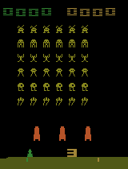

# RL-AGENTS

Repository used for my reinforcement learning projects during my internship.
During this internship, I studied several Deep Reinforcement Learning algorithms and applied them in many environments, like the Atari benchmark, the OpenAi Gym environment or the NIPS Learning to Run competiton.

<!--  -->

## Requirements
- Python 3.x
- Tensorflow 1.4
- [OpenAi Gym]
- [Arcade Learning Environment]

I reimplemented mainly three different algorithms :
- [A3C] : a parallelisable actor-critic which can run on many CPUs at the same time, allowing to solve many Atari Games from pixel input in just a few dozen hours.
- [DDPG] : a continuous actor-critic to solve problems such as BipedalWalker, or the NIPS competiton
- [Rainbow]\(WIP) : a combination of 6 improvements of the regular DQN algorithm

I am currently working on the implementation of an asynchronous version of DDPG that uses the distributional approach of [C51] and runs on GPU called [D4PG].
This algorithm achieves state of the art performance on many tasks and could be used to solve the NIPS Challenge.

The BlogFiles folder contains a Jupiter Notebook that explains my implementation of the algorithms, and a short review of several papers I read during my internship.
The Environment_Tests folder contains application of general algorithms to specific environments : that's here that I ran the code to solve Pong for instance.
The Gif folder contains visual results on different environments.

[OpenAi Gym]: https://github.com/openai/gym
[Arcade Learning Environment]: https://github.com/mgbellemare/Arcade-Learning-Environment

[A3C]: https://arxiv.org/pdf/1602.01783.pdf
[C51]: https://arxiv.org/pdf/1707.06887.pdf
[DDPG]: https://arxiv.org/pdf/1509.02971.pdf
[D4PG]: https://openreview.net/pdf?id=SyZipzbCb
[Rainbow]: https://arxiv.org/pdf/1710.02298.pdf
